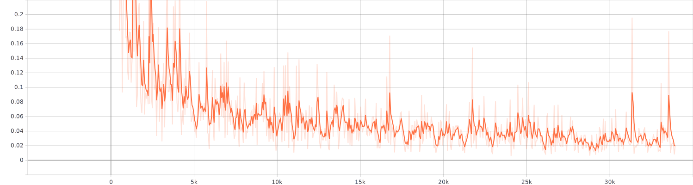

# Real-time Object Detection Product

IVE FYP 1920 Module

- [Real-time Object Detection Product](#real-time-object-detection-product)
  - [System Requirements](#system-requirements)
  - [Installation instructions](#installation-instructions)
    - [Linux](#linux)
    - [Mac OS](#mac-os)
  - [Model Info](#model-info)
    - [Total Loss](#total-loss)

## System Requirements

- Python 3.6
- TensorFlow 1.15
- Flask
- Pandas

## Installation instructions

### Linux

1. Extract the archive and put it in the folder you want

2. `git clone https://github.com/tensorflow/models`

3. install Python library

    ```shell script
    pip install flask
    pip install Cython
    pip install contextlib2
    pip install pillow
    pip install lxml
    pip install matplotlib
    pip install pandas
    pip install opencv-python
    pip install tensorflow==1.15
    pip install imutils
    pip install requests
    ```

4. Add necessary environment variables

    ```shell script
    export PYTHONPATH=$PYTHONPATH:<PATH_TO_TF>/models/research
    export PYTHONPATH=$PYTHONPATH:<PATH_TO_TF>/models/research/object_detection
    export PYTHONPATH=$PYTHONPATH:<PATH_TO_TF>/models/research/slim
    ```

5. Compile Protobufs

    ```shell script
    protoc object_detection/protos/*.proto --python_out=.
    ```

6. navigate to `tensorflow/models/research` and run:

    ```shell script
    python setup.py build
    python setup.py install
    ```

7. navigate to this project folder

8. run `python webstreaming.py --ip 127.0.0.1 --port 8000`

9. enjoy [http://127.0.0.1:8000](http://127.0.0.1:8000)

### Mac OS

1. Install [Homebrew](https://brew.sh/)

    ```shell script
    /usr/bin/ruby -e "$(curl -fsSL https://raw.githubusercontent.com/Homebrew/install/master/install)"
    export PATH="/usr/local/bin:/usr/local/sbin:$PATH"
    brew update
    ```

2. Install Python 3.6

    ```shell script
    brew unlink python
    brew install --ignore-dependencies https://raw.githubusercontent.com/Homebrew/homebrew-core/f2a764ef944b1080be64bd88dca9a1d80130c558/Formula/python.rb
    ```

3. update openssl version

    update openssl version to 1.0.2t fix pip3 ssl

    > pip is configured with locations that require TLS/SSL, however the ssl module in ...

    - check openssl version

    ```shell script
    ls /usr/local/Cellar/openssl/
    ```

    - switch openssl version to 1.0.2t

    ```shell script
    brew switch openssl 1.0.2t
    ```

    - install openssl

    ```shell script
    brew install https://github.com/tebelorg/Tump/releases/download/v1.0.0/openssl.rb
    ```

4. Create a virtual environment

    ```shell script
    pip3 install --upgrade virtualenv
    virtualenv --system-site-packages -p python3 targetDirectory
    ```

    targetDirectory is your Virtualenv Directory

    ```shell script
    cd targetDirectory
    source ./bin/activate
    ```

5. `git clone https://github.com/tensorflow/models`

6. install Python library

    ```shell script
    pip3 install flask
    pip3 install Cython
    pip3 install contextlib2
    pip3 install pillow
    pip3 install lxml
    pip3 install matplotlib
    pip3 install pandas
    pip3 install opencv-python
    pip3 install tensorflow==1.15
    pip3 install imutils
    pip3 install requests
    ```

7. Install Google Protocol Buffers

    ```shell script
    PROTOC_ZIP=protoc-3.7.1-osx-x86_64.zip
    curl -OL https://github.com/protocolbuffers/protobuf/releases/download/v3.7.1/$PROTOC_ZIP
    sudo unzip -o $PROTOC_ZIP -d /usr/local bin/protoc
    sudo unzip -o $PROTOC_ZIP -d /usr/local 'include/*'
    rm -f $PROTOC_ZIP
    ```

8. navigate to `models/research` and run:

    8.1 Compile Protobufs

    ```shell script
    protoc object_detection/protos/*.proto --python_out=.
    ```

    8.2 Protobufs build

    ```shell script
    python3 setup.py build
    python3 setup.py install
    ```

9. navigate to this project folder

10. run `python3 webstreaming.py --ip 127.0.0.1 --port 8000`

11. enjoy [http://127.0.0.1:8000](http://127.0.0.1:8000)

## Model Info

- Labeling data tools : [LabelImg](https://github.com/tzutalin/labelImg)
- Training model:  [faster_rcnn_inception_v2_coco](https://github.com/tensorflow/models/blob/master/research/object_detection/g3doc/detection_model_zoo.md#coco-trained-models)
- Dataset size: 318 photos
- Training step: 33816
- Number of products: 11

### Total Loss

